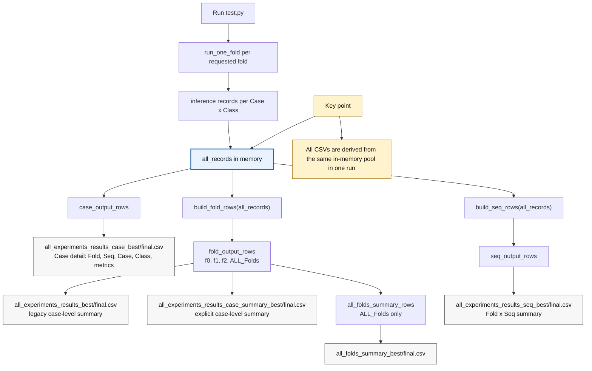

# Test CSV Data Flow

This diagram shows how one in-memory metric pool is used to write the test CSV files.

```mermaid
flowchart TD
    A["Run test.py"] --> B["run_one_fold per requested fold"]
    B --> C["inference records per Case x Class"]
    C --> D["all_records in memory"]
    D --> E["case_output_rows"]
    E --> F["all_experiments_results_case_best/final.csv<br/>Case detail: Fold, Seq, Case, Class, metrics"]
    D --> G["build_fold_rows(all_records)"]
    G --> H["fold_output_rows<br/>f0, f1, f2, ALL_Folds"]
    H --> I["all_experiments_results_best/final.csv<br/>legacy case-level summary"]
    H --> J["all_experiments_results_case_summary_best/final.csv<br/>explicit case-level summary"]
    H --> K["all_folds_summary_rows<br/>ALL_Folds only"]
    K --> L["all_folds_summary_best/final.csv"]
    D --> M["build_seq_rows(all_records)"]
    M --> N["seq_output_rows"]
    N --> O["all_experiments_results_seq_best/final.csv<br/>Fold x Seq summary"]
    P["Key point"] --> D
    P --> Q["All CSVs are derived from the same in-memory pool in one run"]
    classDef pool fill:#e8f3ff,stroke:#2463a6,stroke-width:2px,color:#111;
    classDef csv fill:#f7f7f7,stroke:#555,color:#111;
    classDef note fill:#fff3cd,stroke:#9a6b00,color:#111;
    class D pool;
    class F,I,J,L,O csv;
    class P,Q note;
```
